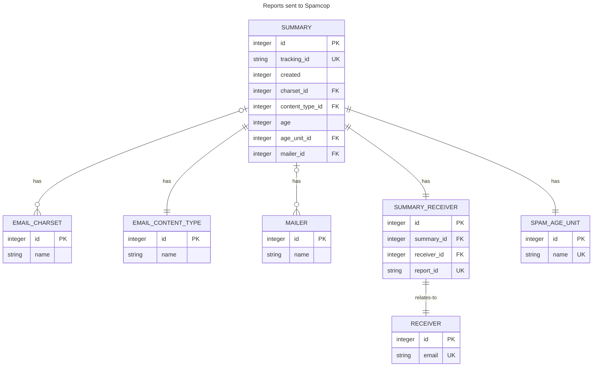

# Local database schema

```mermaid
---
title: Reports sent to Spamcop
---
erDiagram
    SUMMARY |o--o{ EMAIL_CHARSET : has
    SUMMARY ||--|| EMAIL_CONTENT_TYPE : has
    SUMMARY |o--o{ MAILER : has
    SUMMARY ||--|| SUMMARY_RECEIVER : has
    SUMMARY ||--|| SPAM_AGE_UNIT : has
    SUMMARY_RECEIVER ||--|| RECEIVER : relates-to
    SUMMARY {
        integer id PK
        string tracking_id UK
        integer created
        integer charset_id FK
        integer content_type_id FK
        integer age
        integer age_unit_id FK
        integer mailer_id FK
    }
    EMAIL_CHARSET {
        integer id PK
        string name
    }
    EMAIL_CONTENT_TYPE {
        integer id PK
        string name
    }
    MAILER {
        integer id PK
        string name
    }
    SUMMARY_RECEIVER {
        integer id PK
        integer summary_id FK
        integer receiver_id FK
        string report_id UK
    }
    RECEIVER {
        integer id PK
        string email UK
    }
    SPAM_AGE_UNIT {
        integer id PK
        string name UK
    }
```
