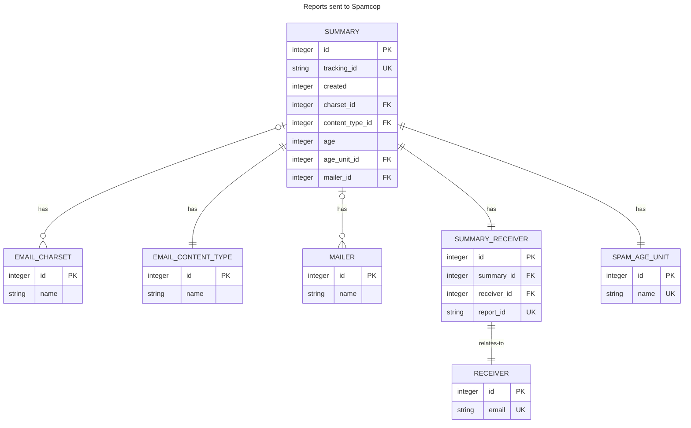

# pyspamcop

Web crawler for finishing [SpamCop.net](https://www.spamcop.net) reports
automatically.

## Description

pyspamcop is a web crawler for finishing
[SpamCop.net](https://www.spamcop.net/) reports automatically.

It will use your account details to login into SpamCop web page and finish
reporting your SPAM. Spamcup NG tries to be as polite as possible, introducing
forced delays to not overwhelm SpamCop.net website. All reports are sent
sequentially.

pyspamcop also saves data from the report sends to Spamcop. The data
available are only those exposed by Spamcop itself, there is no correlation of
the statistics Spamcop have and save for themselves.

pyspamcop is a rewrite from the
[pyspamcop](https://github.com/glasswalk3r/App-SpamcupNG) project.

## Introduction

1. Create a configuration file
1. In your favorite shell:

```
  spamcop
```

That's it! See the configuration file details.

You can also provide some of the parameters in the command line.

Usage:

```
  pyspamcop --help
```

## Warnings

Some important warnings before starting using `pyspamcop`:

- The program does **not** know where the SPAM report will be sent so **it's
your responsibility**!
- If the program asks Spamcop to send reports to wrong places **it's your
fault**!
- If the program has a bug that causes same report being sent thousand times
**it's your mail addresses**!

## Setup

pyspamcop is distributed as a regular Python module, so you can install from
[pypi.org](https://pypi.org) repository with `pip` or any other program that
you use to install Python modules.

### Configuration file

You can also provide a configuration file to avoid having to provide the same
information everytime you want to execute the program.

The program will look for a configuration file name `.spamcop.yaml` in the
corresponding home directory of the user (that will dependend on the OS you're
executing it). Pay attention to the dot ('.') in front of the file.

The configuration file must be written as an YAML file, with the exact
properties below:

```YAML
---
execution_options:
  all_reports: true
  automatic_confirmation: true
  dry_run: false
  verbosity: INFO
  database:
    enabled: true
    path: /var/spamcop/reports.db
accounts:
  Provider1:
    email: account@provider1.com
    password: FOOBAR
  Provider2:
    email: account@provider2.com
    password: FOOBAR
```
All those options have their corresponding command line parameter. Be sure to
take care of file permissions to avoid disclosure of your SpamCop.net password!

### Local database

You probably noticed the following configuration lines from the YAML:

```YAML
  database:
    enabled: true
    path: /var/spamcupng/reports.db
```

Those lines define the configuration for a local database based on
[SQLite](https://sqlite.org/).

This database will save data related to the submitted reports and can be used
to provide further details of what kind of SPAM you're getting and from.

## Local database schema



# Copyright and license

This software is copyright (c) 2018 of Alceu Rodrigues de Freitas Junior,
<glasswalk3r@yahoo.com.br>

This file is part of pyspamcop.

pyspamcop is free software: you can redistribute it and/or modify
it under the terms of the GNU General Public License as published by
the Free Software Foundation, either version 3 of the License, or
(at your option) any later version.

pyspamcop is distributed in the hope that it will be useful,
but WITHOUT ANY WARRANTY; without even the implied warranty of
MERCHANTABILITY or FITNESS FOR A PARTICULAR PURPOSE. See the
GNU General Public License for more details.

You should have received a copy of the GNU General Public License
along with pyspamcop. If not, see http://www.gnu.org/licenses/.
