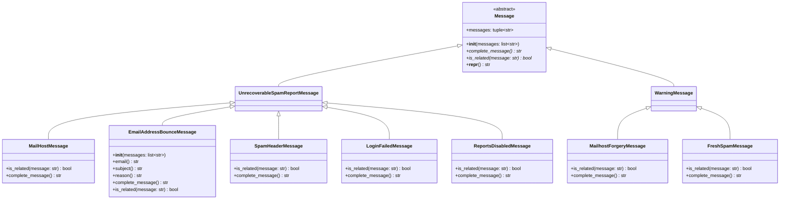
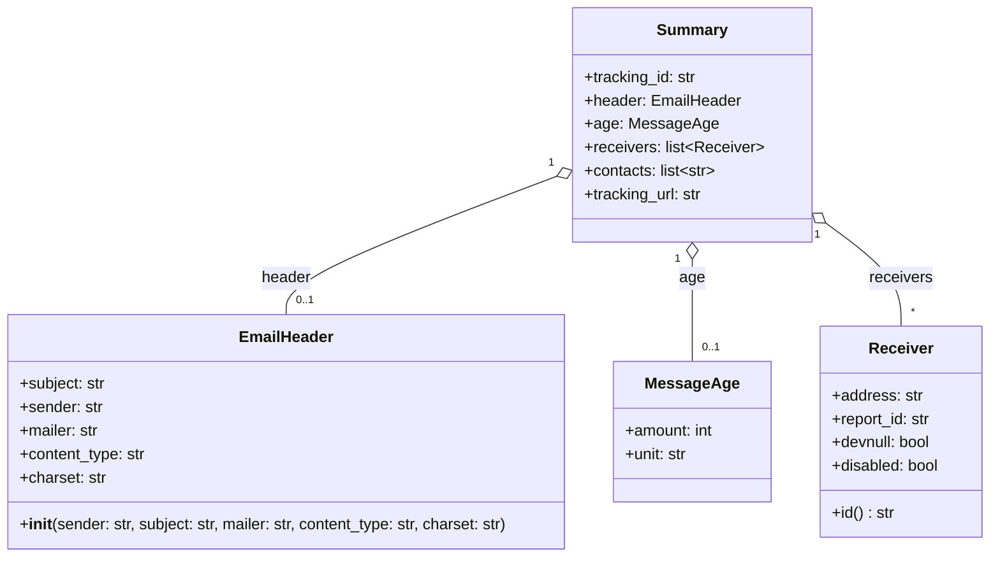
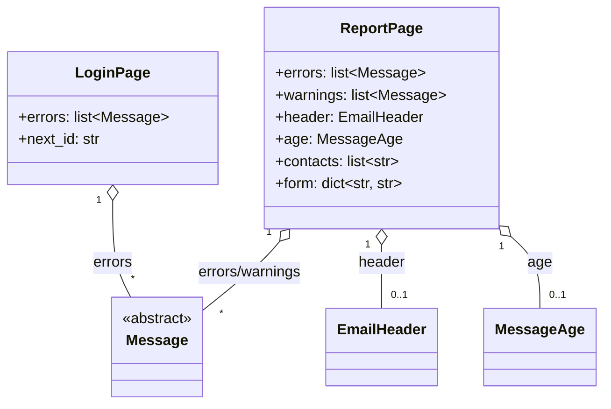
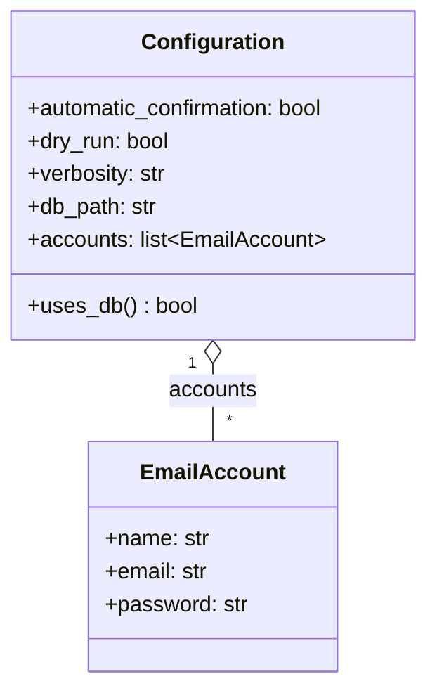
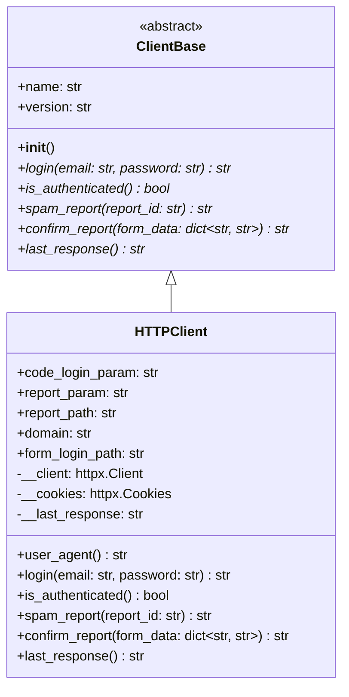
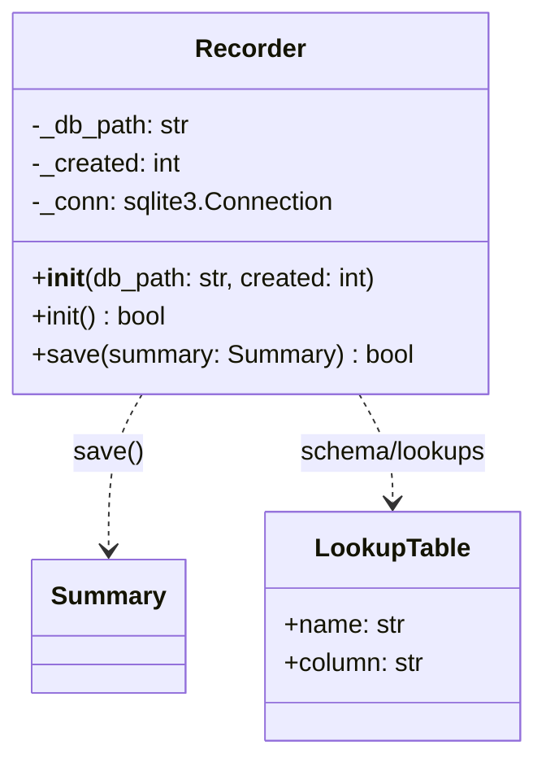
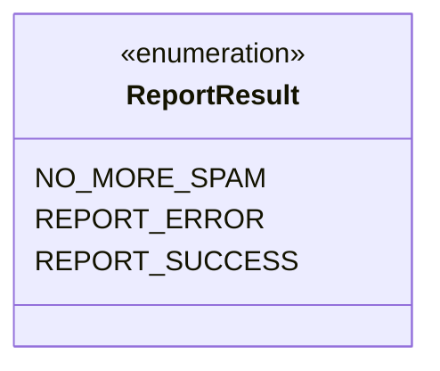
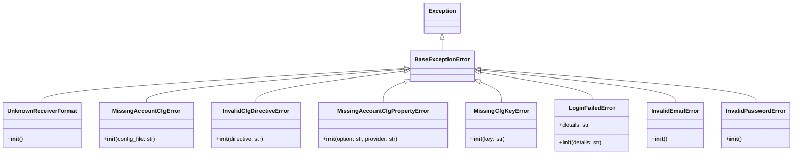

# UML Class Diagrams

Class diagrams for every class in `src/pyspamcop/`, grouped by module. Diagrams are kept per-module (rather than one
giant graph) for readability; cross-module relationships are called out in the prose above each diagram.

## Domain model — `Message` hierarchy (`domain.py`)

`Message` is the abstract base for everything parsed off a SpamCop page. It splits into two branches:
`UnrecoverableSpamReportMessage` (skip this report) and `WarningMessage` (report can still complete).

## Domain model — report data (`domain.py`)

`Summary` aggregates everything collected during one complete SPAM report cycle.

## HTML parsing (`html.py`)

`LoginPage` and `ReportPage` are the parsed representations of the two SpamCop pages `parse_login_page()` and
`parse_report_page()` produce; `parse_confirmation_page()` returns a plain `list[Receiver]` (no dedicated wrapper
class). Both page types are populated with `Message` subclasses and the shared `EmailHeader`/`MessageAge` types from
`domain.py`.

## Configuration (`config.py`)

## SpamCop client abstraction (`spamcop/client.py`, `http/client.py`)

## Persistence (`db.py`)

`Recorder` persists a `Summary` to SQLite, normalizing repeated string values into small lookup tables. `LookupTable` is
a plain `(name, column)` pair; the module-level `_LOOKUP_TABLES` tuple of them drives both the schema DDL and the
runtime column lookup, so it is not tied to a single `Recorder` instance.

## Report result (`runner.py`)

`ReportResult` is returned by `main_loop()` and `run_account()`, and consumed by `main.py` to print the outcome of
processing an account.

## Exceptions (cross-cutting)

All custom exceptions in the package derive from `BaseExceptionError` (`exception.py`).

Defined in: `UnknownReceiverFormat` — `exception.py`; `MissingAccountCfgError`, `InvalidCfgDirectiveError`,
`MissingAccountCfgPropertyError`, `MissingCfgKeyError` — `config.py`; `LoginFailedError` — `spamcop/client.py`;
`InvalidEmailError`, `InvalidPasswordError` — `http/client.py`.
